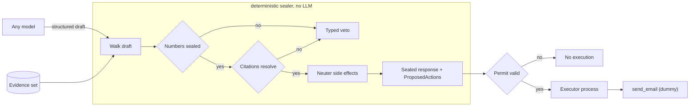

# citeclamp

*The model drafts. It never signs, and it never sends.*

**Status:** pre-release. Design frozen, build not started. No live endpoint yet. Endpoint URLs and any measured value read `__AFTER_DEPLOY__` until the first deploy lands.

## What it does

citeclamp is an HTTP service and a small TypeScript library that sit between any model and the world. The model is demoted to one job: emit a structured draft of sentences and proposed tool calls. It never receives an execute path.

A deterministic sealer, with no model inside it, walks that draft:

1. It reads the draft and the evidence set.
2. It seals every number. A number passes only as a byte-span copy from an evidence item, or as the output of a registered calculator over hashed inputs.
3. It seals every factual sentence. A factual sentence passes only when it cites an evidence id that exists.
4. It neuters every side effect. An email, a Slack post, a CRM write, an HTTP POST becomes a ProposedAction that cannot fire.
5. It returns a sealed response, or it returns a list of typed vetoes.

The veto is not an error path. It is the default. A draft earns a sealed response by clearing every gate, or it comes back with `UNSIGNED_NUMBER`, `ORPHAN_CITATION`, or `SIDE_EFFECT_WITHOUT_PERMIT` and stops there. The model is never handed the execute path, so it cannot smuggle one.

## Two processes, one permit

Execution is a second process. It runs a ProposedAction only against a one-time permit token that the generator cannot mint. The process that writes the draft and the process that acts on it never share an authority. A permit is single use. It binds to one action. It burns on redemption.

## Architecture



The model writes a draft. The sealer walks it with no model in the loop. A pass returns a sealed response plus any inert ProposedActions. A failure returns typed vetoes. The executor is a separate process. It redeems a one-time permit, runs the bound action once, then burns the permit.

## The three seals

| Seal | Passes when | Veto on failure |
|---|---|---|
| Number | The value is a byte-span copy of evidence text, or a calculator output over hashed inputs | `UNSIGNED_NUMBER` |
| Citation | The factual sentence cites an evidence id that exists | `ORPHAN_CITATION` |
| Side effect | Never. Every side effect becomes an inert ProposedAction, and a side effect written as prose is refused | `SIDE_EFFECT_WITHOUT_PERMIT` |

A draft that fails the schema itself returns `MALFORMED_DRAFT` before any seal runs.

## Ship order

Each merge is demoable on its own. The build runs as spec-driven sessions. One session is one `plan.md`. The planner writes the plan. A separate execution agent writes the code from the plan and the repo alone.

| Session | Merge | Deliverable | Status |
|---|---|---|---|
| 00 | 1 | Scaffold, schemas, shared types, the veto union | planned |
| 01 | 1 | Number sealing: evidence spans and the calculator registry | planned |
| 02 | 1 | Citation sealing and side-effect neutering | planned |
| 03 | 1 | The `seal()` walk and a paste-a-draft CLI | planned |
| 04 | 2 | 20 to 40 fixtures and a fixture runner | planned |
| 05 | 3 | One HMAC endpoint: `/seal` signed, `/health` open | planned |
| 06 | 4 | Executor process, one-time permit, dummy `send_email` | planned |

Session 03 closes the first demo: paste a JSON draft, get a sealed response or veto codes, with no agent and no network.

## What it does not do

It does not judge whether a claim is true. It checks that the claim is sourced and that its numbers are sealed. The truth of the evidence set is the caller's problem. Provenance is citeclamp's.

It does not sandbox the executor. It gates the executor with a permit the generator cannot mint. A compromised permit authority is out of scope for v1.

It does not run the model. Any model can sit in front of it, because citeclamp reads only the draft the model emits.

## Repo map

```
schemas/
  draft.schema.json           the draft the model may emit, additionalProperties false
  evidence.schema.json        the evidence set the sealer reads
  sealed_response.schema.json the pass shape
  veto.schema.json            the fail shape
src/
  types.ts             shared types, discriminated unions for outcomes and vetoes
  constants.ts         veto codes and pinned keys
  hash.ts              canonical stringify and sha256
  schema.ts            Ajv validators, additionalProperties false
  evidence_store.ts    evidence lookup and byte-span match
  calculators.ts       calculator registry and input hashing
  seal_numbers.ts      number seal, UNSIGNED_NUMBER
  seal_citations.ts    citation seal, ORPHAN_CITATION
  seal_side_effects.ts side-effect neuter, SIDE_EFFECT_WITHOUT_PERMIT
  sealer.ts            the seal() walk
  auth.ts              HMAC-SHA256 verification
  server.ts            /seal (HMAC) and /health (open)
  permit.ts            permit verify and burn
  executor.ts          second process, permit-gated
  tools/send_email.ts  dummy side-effect tool
tests/       one test file per module
fixtures/    invented totals, near-miss citations, extra digits, smuggled tool calls
scripts/     seal.ts paste-a-draft CLI, bash smoke scripts
specs/       permit.tla and permit.cfg, the permit lifecycle
config/      pinned values as *.json, read-only tool allowlist and side-effect list
sessions/    the plan.md files, one per session, run in order
```

## Build

citeclamp is built with a two-agent, spec-driven flow. The planner reads a task and returns one `plan.md`. The execution agent reads only `plan.md` and the repo, then writes the code. The plan is read-only after handoff. Every plan instruction is written in Simplified Technical English and EARS. The session plans live in `sessions/` and run in order, 00 through 06.

## Lineage

citeclamp descends from the grounding gate in [document_intelligence_rag](https://github.com/jakemorganlabs/document_intelligence_rag), where every answer had to quote a passage that verifiably contained it, or the system abstained. citeclamp takes that verbatim-match discipline off the RAG path and makes it a standalone seal any model can run behind. It extends the same refusal logic from words to actions.

## Author

Jake Morgan · Portfolio: jakemorganlabs.dev · LinkedIn: linkedin.com/in/jakemorganlabs · Contact: jakemorganlabs@gmail.com
