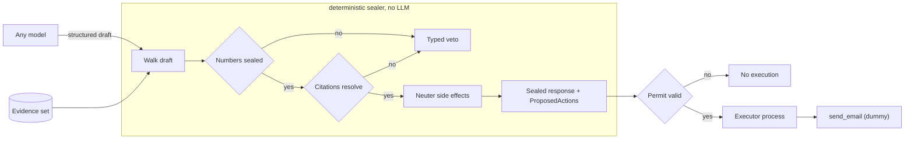

# citeclamp

The model drafts. It never signs, and it never sends.

[](https://github.com/jakemorganlabs/citeclamp/actions/workflows/test.yml)


**Status:** v1.0.0. Deployed on a single Hetzner VPS as a systemd service, bound to loopback behind HMAC. Public hostname `https://seal.jakemorganlabs.dev` is being attached to the Cloudflare tunnel; until it resolves, the endpoint below answers only on the box.
**Seal endpoint:** `https://seal.jakemorganlabs.dev/seal` (HMAC signed, rate limited 5 req / 10 s / IP).
**Health probe:** `https://seal.jakemorganlabs.dev/health` (no auth, no seal).

## Scope of the deployment

The deployed `/seal` seals every draft against one fixed evidence set: [`examples/evidence.json`](examples/evidence.json), baked into the server at boot. It holds one item, `e-1`, that reads "The link is limited to 90 metres." A draft that cites any other id comes back `ORPHAN_CITATION`. That is the sealer working, not a fault. Per-request evidence is a later session.

The service calls no model. It has no database, no migrations, and no generated objects. It reads a draft, walks it, and returns a sealed response or a veto list. Any model can sit in front of it, because citeclamp reads only the draft the model emits.

## Live demo

A signed request and a sealed response, then the same endpoint vetoing a draft whose number does not match the evidence. The veto is the point.

**Signed request:**
```bash
BODY='{"sentences":[{"text":"The link is limited to 90 metres.","kind":"factual","citations":["e-1"],"numbers":[{"value":"90","claim":{"kind":"evidence_span","evidence_id":"e-1","start":23,"end":25}}]}],"tool_calls":[]}'
TIMESTAMP=$(date +%s)
SIG=$(printf '%s.%s' "$TIMESTAMP" "$BODY" | openssl dgst -sha256 -hmac "$HMAC_SECRET" -hex | awk '{print $2}')
curl -s -H "x-citeclamp-timestamp: $TIMESTAMP" -H "x-citeclamp-signature: $SIG" \
     -H "content-type: application/json" --data-binary "$BODY" \
     https://seal.jakemorganlabs.dev/seal | jq .
```

**Sealed:**
```json
{
  "sealed": true,
  "sentences": [{ "text": "The link is limited to 90 metres.", "citations": ["e-1"] }],
  "sealed_numbers": [
    { "value": "90", "proof": { "kind": "evidence_span", "evidence_id": "e-1", "start": 23, "end": 25 } }
  ],
  "proposed_actions": []
}
```

**Vetoed** (the same draft with `95` in place of `90`):
```json
{
  "sealed": false,
  "vetoes": [
    { "code": "UNSIGNED_NUMBER", "detail": "span e-1[23:25] does not equal \"95\"", "locus": "sentences[0].numbers[0]" }
  ]
}
```

**Unsigned request:** `401 {"error":"unauthorized"}` before any parse or seal runs.

The captured request and response pairs live in [`docs/evidence/`](docs/evidence/). See Evidence below.

## What it does

citeclamp is an HTTP service and a small TypeScript library that sit between any model and the world. The model is demoted to one job: emit a structured draft of sentences and proposed tool calls. It never receives an execute path.

A deterministic sealer, with no model inside it, walks that draft:

1. It reads the draft and the evidence set.
2. It seals every number. A number passes only as a byte-span copy from an evidence item, or as the output of a registered calculator over hashed inputs.
3. It seals every factual sentence. A factual sentence passes only when it cites an evidence id that exists.
4. It neuters every side effect. An email, a Slack post, a CRM write, an HTTP POST becomes a ProposedAction that cannot fire.
5. It returns a sealed response, or it returns a list of typed vetoes.

The veto is not an error path. It is the default. A draft earns a sealed response by clearing every gate, or it comes back with `UNSIGNED_NUMBER`, `ORPHAN_CITATION`, or `SIDE_EFFECT_WITHOUT_PERMIT` and stops there. A draft that fails the schema itself returns `MALFORMED_DRAFT` before any seal runs.

## Two processes, one permit

Execution is a second process. It runs a ProposedAction only against a one-time permit token that the generator cannot mint. The process that writes the draft and the process that acts on it never share an authority. A permit is single use. It binds to one action. It burns on redemption.

The executor CLI shows the lifecycle end to end. Run without a permit, it refuses with `NO_PERMIT`. Run with a freshly minted permit, it runs the dummy `send_email` once and returns a receipt. Run again with the same permit, it refuses with `PERMIT_SPENT`. The capture is [`docs/evidence/executor_permit_lifecycle.json`](docs/evidence/executor_permit_lifecycle.json).

## Architecture



The model writes a draft. The sealer walks it with no model in the loop. A pass returns a sealed response plus any inert ProposedActions. A failure returns typed vetoes. The executor is a separate process. It redeems a one-time permit, runs the bound action once, then burns the permit.

## The three seals

| Seal | Passes when | Veto on failure |
|---|---|---|
| Number | The value is a byte-span copy of evidence text, or a calculator output over hashed inputs | `UNSIGNED_NUMBER` |
| Citation | The factual sentence cites an evidence id that exists | `ORPHAN_CITATION` |
| Side effect | Never. Every side effect becomes an inert ProposedAction, and a side effect written as prose is refused | `SIDE_EFFECT_WITHOUT_PERMIT` |

## Evidence

Every file under [`docs/evidence/`](docs/evidence/) is a real request against the deployed service, captured by [`scripts/capture_evidence.sh`](scripts/capture_evidence.sh). No file carries a secret.

| File | What it shows |
|---|---|
| `sealed_pass.json` | One sealed draft. The number `90` is the byte span `e-1[23:25]`. |
| `veto_unsigned_number.json` | `UNSIGNED_NUMBER`. The draft says `95`; the span reads `90`. |
| `veto_orphan_citation.json` | `ORPHAN_CITATION`. The draft cites `e-9`; the set holds only `e-1`. |
| `veto_side_effect_without_permit.json` | `SIDE_EFFECT_WITHOUT_PERMIT`. The verb "send" sits in prose instead of a declared tool call. |
| `sealed_with_proposed_action.json` | A declared `send_email` call neutered into one inert ProposedAction, `requires_permit: true`. |
| `executor_permit_lifecycle.json` | The executor refused with `NO_PERMIT`, run once on a one-time permit, refused on replay with `PERMIT_SPENT`. |
| `unsigned_request_401.json` | An unsigned POST rejected with 401 before any parse. |

## Security

1. `/seal` verifies `HMAC-SHA256(secret, "timestamp.rawbody")` in hex from the headers `x-citeclamp-timestamp` and `x-citeclamp-signature`. The compare is constant time. The body is verified as raw bytes before any JSON parse.
2. A timestamp outside the 300 second skew window is refused as stale (`config/server.json`).
3. The service binds `127.0.0.1:8787` only. The public hostname is a Cloudflare tunnel with no open inbound port.
4. A Cloudflare WAF rule blocks any IP above 5 requests per 10 seconds on the hostname.
5. The systemd unit runs as an unprivileged user with `NoNewPrivileges` and `PrivateTmp`.
6. The only secret is `HMAC_SECRET`, read from `deploy/.env.production`, which is gitignored. The repo tracks only `deploy/.env.production.example`.

## Run locally

1. Install Node 22.15 or newer. The service runs the TypeScript sources with Node's native type stripping. There is no build step and no tsx.
2. Run `npm ci`.
3. Run `npm test`, `npm run types`, and `npm run lint`.
4. Seal a draft with no server: `npm run seal -- examples/draft_pass.json examples/evidence.json`. Exit 0 is a pass, exit 1 is a veto.
5. Walk the permit lifecycle: `npm run -s seal -- examples/draft_send_email.json examples/evidence.json > sealed.json && npm run execute -- sealed.json`.
6. Start the server: `HMAC_SECRET=$(openssl rand -hex 32) npm start`. Then `npm run smoke` with the same `HMAC_SECRET` exported sends one signed request to `/seal`.

## Deploy

1. Clone to `/opt/citeclamp` and run `npm ci --omit=dev`. That installs ajv only.
2. Copy `deploy/.env.production.example` to `deploy/.env.production`, set `HMAC_SECRET`, and `chmod 600` it.
3. Copy `deploy/citeclamp.service` to `/etc/systemd/system/`, then `systemctl daemon-reload && systemctl enable --now citeclamp`.
4. Point a Cloudflare tunnel public hostname at `http://localhost:8787` with an empty path. Set the rate limit rule before exposing.
5. Follow the logs with `journalctl -u citeclamp -f`. Each request logs one JSON line with a `trace_id`, route, action, and status.

## CI and release

1. `Test` runs on every push and pull request to `main`: vitest, `tsc --noEmit`, eslint, the seal and executor CLIs, then a server boot under the native strip-types hook with one signed smoke request and one unsigned 401.
2. A `v*` tag creates a GitHub Release and a SLSA build-provenance attestation.
3. Release: https://github.com/jakemorganlabs/citeclamp/releases/tag/v1.0.0

## What it does not do

It does not judge whether a claim is true. It checks that the claim is sourced and that its numbers are sealed. The truth of the evidence set is the caller's problem. Provenance is citeclamp's.

It does not accept evidence per request. The deployed sealer knows one evidence set. Per-request evidence is a later session.

It does not sandbox the executor. It gates the executor with a permit the generator cannot mint. A compromised permit authority is out of scope for v1.

It does not run the model. Any model can sit in front of it, because citeclamp reads only the draft the model emits.

## Repo map

```
schemas/
  draft.schema.json           the draft the model may emit, additionalProperties false
  evidence.schema.json        the evidence set the sealer reads
  sealed_response.schema.json the pass shape
  veto.schema.json            the fail shape
src/
  types.ts             shared types, discriminated unions for outcomes and vetoes
  constants.ts         veto codes and pinned keys
  hash.ts              canonical stringify and sha256
  schema.ts            Ajv validators, additionalProperties false
  evidence_store.ts    evidence lookup and byte-span match
  calculators.ts       calculator registry and input hashing
  seal_numbers.ts      number seal, UNSIGNED_NUMBER
  seal_citations.ts    citation seal, ORPHAN_CITATION
  seal_side_effects.ts side-effect neuter, SIDE_EFFECT_WITHOUT_PERMIT
  sealer.ts            the seal() walk
  fixture_runner.ts    load a fixture, run seal, compare to the expected outcome
  auth.ts              HMAC-SHA256 verification
  server.ts            /seal (HMAC) and /health (open)
  permit.ts            permit mint, verify, and burn
  executor.ts          second process, permit-gated
  tools/send_email.ts  dummy side-effect tool
tests/       one test file per module, 125 tests
examples/    sample drafts and the evidence set the deployed server bakes in
fixtures/    22 adversarial cases: invented totals, near-miss citations, extra digits, smuggled tool calls
scripts/     ts-register.mjs resolve hook, seal.ts and execute.ts CLIs, smoke and evidence capture
specs/       permit.tla and permit.cfg, the permit lifecycle
config/      pinned values as *.json: port and skew, read-only tool allowlist, side-effect verbs, calculators
deploy/      the systemd unit and the env example
docs/        evidence captures from the deployed service
```

## Build

citeclamp was built with a two-agent, spec-driven flow. A planner reads a task and returns one plan. An execution agent reads only the plan and the repo, then writes the code. Each of the seven sessions merged on its own and was demoable on its own. The deploy session added the native strip-types resolve hook, the start scripts, the CI, and the evidence set.

## Lineage

citeclamp descends from the grounding gate in [document_intelligence_rag](https://github.com/jakemorganlabs/document_intelligence_rag), where every answer had to quote a passage that verifiably contained it, or the system abstained. citeclamp takes that verbatim-match discipline off the RAG path and makes it a standalone seal any model can run behind. It extends the same refusal logic from words to actions.

## Author

Jake Morgan · Portfolio: jakemorganlabs.dev · LinkedIn: linkedin.com/in/jakemorganlabs · Contact: jakemorganlabs@gmail.com
